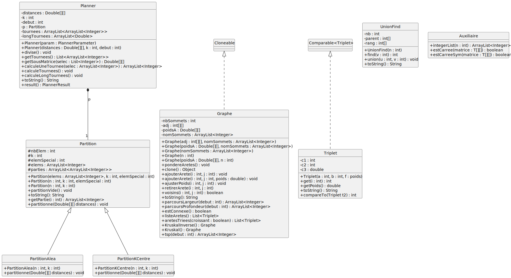

# Projet intégrateur L3 MIAGE : partie Recherche Opérationnelle

## Objectif

Cette partie du projet sert à optimiser les livraisons, c'est-à-dire diviser les livraisons à faire entre les différents livreurs et optmiser la tournée de chacun. Vous allez l'implémenter sous la forme d'un webservice qui :

+ Prend en entrée en entier `k` (nombre de livreurs); une matrice `matrix`de distances n x n, supposée symmétrique dont l'entrée en case (i,j) indique la distance pour aller du lieu i au lieu j; et `start` un entier indiquant le numéro du dépôt parmi les n lieux (les n-1 autres lieux sont à livrer).
+ Renvoie `tournees`, un tableau contenant `k` listes, chacune d'elles correspondant à la tournée d'une livreur, commençant au dépôt et indiquant dans l'ordre l'indice des lieux à livrer (par convention, le livreur revient au dépôt à la fin, sans que le numéro du dépôt ne soit répété); et renvoie également un tableau `longTournees`de k double, la case i contenant la longueur de la tournée du i-ème livreur (y compris le retour au dépôt).

La sortie est valide si :
+ `tournees`et `longTournees` sont tous les deux de longueur `k`
+ chaque tournée contient `start` le numéro du dépôt exactement une fois, au début
+ chaque autre lieu (différent de `start`) est contenu dans exactement une tournée, sans doublon
+ pour i allant de 0 à k-1, si `tournees[i]` contient `[u_0, ..., u_p]`, alors `longTournees[i]` contient (sum<sub>i=0</sub><sup>p-1</sup> matrix[u<sub>i</sub>][u<sub>i+1</sub>]) + matrix[u<sub>p</sub>][u<sub>0</sub>]

Le problème consistant à obtenir des tournées optimales minimisant la distance parcourue par les livreurs est trop difficile à résoudre, nous allons donc utiliser des algorithmes d'approximation, qui, comme leur nom l'indique, nous donnent des solutions qui "approchent" l'optimale. La répartition entre livreurs se fera avec un algorithme glouton de 2-approximation sur k-centre et le calcul de l'ordre de la tournée d'un livreur se fera avec la 2-approximation du Voyageur de Commerce (TSP : Traveling Salesman Problem).

## Modélisation

Nous allons utiliser une modélisation par un graphe : chaque lieu à livrer ainsi que le dépôt sera un sommet du graphe; deux sommets `u` et `v` seront reliés par une arête dont le poids correspondra à la distance entre le lieu `u`et le lieu `v`. La matrice `matrix` donnée en entrée sera donc interprétée comme la matrice de pondération des arêtes sur un graphe complet non-orienté à `n` sommets, où `n`est le nombre de lieux à livrer + 1 (le dépôt, numéro `start`). (On remarque que cette matrice de distances est issue de données cartographique et vérifiera normalement l'inégalité triangulaire : `matrix[u][v] + matrix[v][w] >= matrix[u][w]`, autrement dit aller de `u` à `w` en faisant un détour par un autre sommet `v` est forcément plus long que d'aller directement de `u`à `w`.) Une solution au problème des livreurs est constituée de `k` cycles élémentaires dans ce graphe complet (une tournée = un cycle élémentaire), chaque sommet sauf le dépôt étant parcouru par exactement un de ces cycles (et tous les cycles commencent et terminent au dépôt).

Nous vous fournissons ci-dessous des indications pour mener à bien cette partie du projet, ainsi qu'un diagramme de classes UML qui doit vous gagner du temps sur la conception de vos classes. **Contrairement à d'habitude,** ce diagramme de classes n'est **pas un contrat** et vous avez le droit de le modifier si vous souhaitez ajouter des modifications pertinentes (dont vous devez être capable de défendre l'intérêt à l'oral). 

Les éléments qui sont considérés comme contractuels dans la partie Recherche Opérationnelle de ce projet intégrateur sont :
+ les spécifications indiquées dans la partie Objectif ci-dessus, à respecter absolument
+ l'algorithme de 2-approximation du Voyageur de Commerce défini dans la partie `tsp` version 2.

Cette partie RO contient plusieurs versions incrémentales; il est attendu que vous arriviez tous à la version 2&2 (version 2 pour `Partition` et version 2 pour `tsp`); il serait souhaitable que vous arriviez à la version 2&3 (version 2 pour `Partition` et version 3 pour `tsp`); les versions supérieures (3&2, 2&4, ...) sont considérées comme bonus.


## Le webservice `planif`

Nous vous fournissons un projet `maven` contenant les fichiers nécessaires pour un fonctionnement minimaliste du webservice. Pour qu'il fonctionne, vous devez disposer de `maven`et de `Java 21`; pour tester l'envoi de requêtes, nous vous conseillons l'extension ThunderClient dans VS Code.

Une fois que vous avez récupéré le projet que l'on vous fournit :
+ en ligne de commandes, placez-vous dans le répertoire qui contient `src` (on appelera ce dossier `rep` dans la suite), puis tapez `mvn clean install`; cela permet de compiler le projet
+ ensuite, tapez la commande `java -jar target/planner-0.0.1-SNAPSHOT.jar` pour lancer votre webservice
+ ouvrez le dossier `rep` dans VScode
+ dans l'extension ThunderClient de VSCode, cliquez sur New Request; remplacez l'URL par `http://localhost:8080/planif` et vérifiez que `GET` est sélectionné dans le menu déroulant à gauche de l'URL; sous la requête, dans l'onglet Body -> JSON, fournissez un fichier JSON qui contient les paramètres du webservice : `k`, `matrix` et `start`. Par exemple :
```
{
  "k":1,
  "matrix":[[0,1.1],[1.1,0]],
  "start":0
  
}
```
Cliquez sur Send : la requête interroge votre webservice et récupère la réponse sous la forme d'un autre fichier JSON contenant les sorties, qui s'affiche à droite ; vous devriez dans un premier temps obtenir le fichier JSON suivant :
```
{
  "tournees": [],
  "longTournees": []
}
```


+ tant que votre webservice tourne, votre terminal ne vous rend pas le prompt, il faudra faire `Ctrl-C` pour interrompre le webservice et récupérer votre prompt.

+ Pour tester votre code au fur et à mesure, sans passer par une requête, vous pouvez utiliser la commande `mvn test` dans un terminal (même si votre webservice ne tourne pas); cela lance les tests du fichier `test/java/l3m/cyber/planner/PlannerApplicationTests.java`. Attention, contrairement à ce que vous avez vu en APO, vos tests ne doivent pas être dans un main mais dans une fonction dont vous choisissez le nom, qui ne renvoie rien, et qui est précédé de l'annotation `@Test`. Deux exemples vous sont donnés : `@Test void dummyTest()` qui fait des affichages en console, dont vous devez contrôler la justesse en lisant ce qui s'affiche dans votre terminal (similaire à vos `main` habituels); et un autre test `@Test void nonnullTestPlanning()` qui est plutôt sous le format d'un test unitaire JUnit : des instantations et des appels sont réalisés, puis on vérifie les propriétés voulues avec `assertTrue` ; ce sont ces assertions qui définissent si un test unitaire réussit ou échoue; pour l'instant, ce test vérifie seulement que les sorties `tournees`et `longTournees`sont non `null`, vous pouvez le compléter. N'hésitez pas à consulter le [User Guide de JUnit](https://junit.org/junit5/docs/current/user-guide/)


Parmi les fichiers fournis dans `rep/src/java/l3/cyber/planner`,  se trouvent :
+ `PlannerApplication.java` : à ne pas modifier, c'est ce qui permet de lancer votre webservice
+ `PlannerParameter.java` : à ne pas modifier, c'est une classe de type `record` qui permet de stocker les informations `matrix`, `k` et `start` récupérées automatiquement dans le fichier JSON en entrée du webservice
+ `PlannerResult.java` : à ne pas modifier, c'est aussi une classe de type `record` qui permet de receuillir la sortie de vos calculs, qui sera automatiquement transformée en fichier JSON à la sortie du webservice.
+ `PlannerController.java` : c'est ici que l'on trouve l'annotation `@GetMapping("/planif/")` qui permet de définir le comportement du webservice lorsque la requête termine par `planif`. A priori, vous n'avez pas besoin de le modifier (mais vous êtes libres de le faire) : on y trouve une méthode `planif`, qui récupére une instance `params` de `PlannerParameter` via le fichier JSON en entrée de la requête; une instance `pl` de `Planner` est créée à partir de `params`; puis on appelle la méthode `result` sur l'instance `pl` de `Planner` qui doit retourner une instance de `PlannerResult` contenant les résultats du calcul de tournées.
+ `Planner.java` : c'est ici la classe qui va piloter nos calculs de tournées; ce fichier est à modifier. Vous devez conserver le constructeur qui prend en paramètre un `PlannerParameter`, et vous devez aussi conserver la méthode `result` qui renvoie un `PlannerResult`; pour l'instant, on y trouve `return new PlannerResult(..., ...)` qui crée une instance de `PlannerResult` avec `tournees` et `longTournees` définies comme des tableaux vides (du bon type), ce qui entraîne l'apparition des deux tableaux vides dans le JSON de sortie de la requête; il faudra bien sûr modifier cette partie. 

À la fin de cette section, vous devriez :
+ avoir compris quelles parties du webservice sont à modifier ou non
+ avoir réussi à compiler et lancer votre webservice en ligne de commande (dans l'état initial fourni)
+ avoir compris les deux façons de tester votre projet :
	- test du webservice via l'extension ThunderClient dans VSCode : permet de simuler des requêtes avec un fichier JSON en entrée et un fichier JSON en sortie
	- tests unitaires (avec affichage sur la sortie standard ou avec assertions) dans le fichier `PlannerApplicationTests.java` et la commande `mvn test`

## Diagramme de classes

Les classes `PlannerApplication`, `PlannerController`, `PlannerParameter`et `PlannerResult`, que vous ne devez pas modifier, ne sont pas représentées sur le diagramme de classe pour plus de visibilité.

Si le diagramme de classes ne s'affiche pas ci-dessous, consulter l'image UML.svg dans le répertoire : 


<!--
@startuml
hide circle
skinparam classAttributeIconSize 0

abstract class Partition {
    # nbElem : int
    # k : int
    # elemSpecial : int
    # elems : ArrayList<Integer>
    # parties : ArrayList<ArrayList<Integer>>

    + Partition(elems : ArrayList<Integer>, k : int, elemSpecial : int)
    + Partition(n : int, k : int, elemSpecial : int)
    + Partition(n : int, k : int)
    + partitionVide() : void
    + toString(): String
    + getPartie(i : int) : ArrayList<Integer>
    {abstract} + partitionne(Double[][] distances) : void
    
}


class PartitionAlea extends Partition {
    + PartitionAlea(n : int, k : int)
    + partitionne(Double[][] distances) : void
}

class PartitionKCentre extends Partition {
    + PartitionKCentre(n : int, k : int)
    + partitionne(Double[][] distances) : void
}


class Graphe implements Cloneable{
  - nbSommets : int
  - adj : int[][]
  - poidsA : Double[][]
  - nomSommets : ArrayList<Integer>

  + Graphe(adj : int[][], nomSommets : ArrayList<Integer>)
  + Graphe(poidsA : Double[][], nomSommets : ArrayList<Integer>)
  + Graphe(nomSommets : ArrayList<Integer>)
  + Graphe(n : int)
  + Graphe(poidsA : Double[][], n : int)
  + pondereAretes() : void
  + clone() : Object
  + ajouterArete(i : int, j : int) : void
  + ajouterArete(i : int, j : int, poids : double) : void
  + ajusterPoids(i : int, j : int) : void
  + retirerArete(i : int, j : int)
  + voisins(i : int, j : int) : boolean
  + toString(): String
  + parcoursLargeur(debut : int) : ArrayList<Integer>
  + parcoursProfondeur(debut : int) : ArrayList<Integer>
  + estConnexe() : boolean
  + listeAretes() : List<Triplet>
  + aretesTriees(croissant : boolean) : List<Triplet>
  + KruskalInverse() : Graphe
  + Kruskal() : Graphe
  + tsp(debut : int) : ArrayList<Integer>
}

class Triplet implements "Comparable<Triplet>"{
  - c1 : int
  - c2 : int
  - c3 : double

  + Triplet(a : int, b : int, f : poids)
  + get(i : int) : int
  + getPoids() : double
  + toString() : String
  + compareTo(Triplet t2) : int
}

class UnionFind{
  - nb : int
  - parent : int[]
  - rang : int[]

  + UnionFind(n : int)
  + find(v : int) : int
  + union(u : int, v : int) : void
  + toString() : String
}

class Auxiliaire{
  + {static} integerList(n : int) : ArrayList<Integer>
  + {static} estCarree(matrice : T[][]) : boolean
  + {static} estCarreeSym(matrice : T[][]) : boolean
}

class Planner{
  - distances : Double[][]
  - k : int
  - debut : int
  - p : Partition
  - tournees : ArrayList<ArrayList<Integer>>
  - longTournees : ArrayList<Double>


  + Planner(param : PlannerParameter)
  + Planner(distances : Double[][], k : int, debut : int)
  + divise() : void
  + getTournees() : List<ArrayList<Integer>>
  + getSousMatrice(selec : List<Integer>) : Double[][]
  + calculeUneTournee(selec : ArrayList<Integer>) : ArrayList<Integer>
  + calculeTournees() : void
  + calculeLongTournees() : void
  + toString() : String
  + result() : PlannerResult

}

Planner *--"1" Partition : p


@enduml
-->

## `Partition`: la répartition des livraisons entre livreurs

La répartition des livraisons entre livreurs se fera grâce à une `Partition`, qui sera ensuite déclinée sous forme de `PartitionAlea`(utilisera une stratégie aléatoire pour partitionner) ou  `PartitionKCentre` (se basera sur un algorithme glouton de 2-approximation pour le problème k-centres). 

On définit la classe abstraite `Partition` avec :
+ attribut `nbElem` : le nombre d'élements qu'il faudra partitionner, dans notre cas le nombre de sommets du graphe;
+ attribut `k`: le nombre de parties souhaitée dans la partition, qui correspondra pour nous au nombre de livreurs;
+ attribut `elemSpecial` qui est un élément qui devra se trouver dans toutes les parties de la partition, qui correspondra pour nous au dépôt (tous les livreurs doivent passer au dépôt); on remarque alors que la division que l'on doit faire n'est pas exactement une partition de `elems` en k parties au sens mathématique, car l'intersection entre deux parties de la partition ne sera pas disjoint (le dépôt, et seulement lui, apparaîtra dans plusieurs tournées).
+ attribut `elems` : liste d'élements à partitionner, pour nous ce sera la liste des sommets, donc les entiers de 0 à n-1 mais on pourrait choisir d'autres entiers.
+ attribut `parties` : liste de taille `k`, chaque élément étant une liste correspondant à une partie de la partition.
+ méthode abstraite `void partitionne(Double[][] distance)` : sera définie dans les sous-classes non-abstraites, en fonction de la stratégie de partition choisie (utilisant potentiellement `distance`). Le but de cette méthode sera de remplir correctement l'attribut `parties` pour obtenir la partition souhaitée.
+ méthode `partitionVide()` : alloue la mémoire nécessaire pour `parties` (liste de k listes), et met l'élément spécial dans chacune des parties. Autrement dit, à la fin, chaque partie est un singleton contenant l'élément spécial. Sera appelé dans le constructeur.
+ méthode `toString()` : crée une description textuelle de la partition (présentation textuelle laissée à votre appréciation).
+ méthode `getPartie(int i)` permettant d'accéder à la i-ème partie de la partition.
+ constructeur `Partition(ArrayList<Integer> elems, int k, int elemSpecial)` : crée une `Partition` dont le but sera de partitionner les éléments `elems` en `k` parties, avec `elemSpecial` apparaissant dans chaque partie (à part cela, les parties sont disjointes).
+ constructeur `Partition(int n, int k, int elemSpecial)` : idem constructeur ci-dessus, en prenant les entiers de 0 à n-1 comme `elems` (s'aider d'une fonction de la classe `Auxiliaire`).
+ constructeur  `Partition(int n , int k)` : idem constructeur ci-dessus, en prenant 0 comme `elemSpecial`. 


### Version 1 : partition aléatoire

Cette façon de partitionner n'est pas très intelligente, mais vous permettra d'avoir rapidement une implémentation de partition à articuler avec le reste de votre projet.

Il s'agit donc de créer une classe `PartitionAlea` qui hérite de `Partition`, et qui implémente la méthode `paritionne` ainsi : pour chaque élément (sauf l'élément spécial qui doit apparaître dans toutes les parties), on tire un entier i au hasard entre 1 et k (ou 0 et k-1), et on place l'élément dans la i-ème partie de la partition.

### Version 2 : partition basée sur k-centres

Cette façon de partitionner n'est pas optimale, mais permettra sans doute de meilleurs résultats que la partition aléatoire. Elle se base sur le problème d'optimisation combinatoire appelé k-centres, qui prend en entrée un graphe et un entier k, et qui cherche à choisir k sommets sur lesquels on installera une infrastructure (par exemple, des casernes de pompiers). Chaque sommet du graphe aura pour caserne de référence la caserne la plus proche de lui dans le graphe, parmi les k casernes choisies. Le but est de minimiser la distance maximum entre n'importe quel sommet `v` et sa caserne référente (celle qui intervient en cas de feu au sommet `v`), autrement dit que tout le monde soit le plus proche possible d'une caserne.

Nous allons utiliser une heuristique gloutonne qui donne une 2-approximation pour le problème k-centre, que l'on transformera en une partition à k parties : chacune des k casernes choisies formera une partie avec tous les sommets dont elle est référente.

La classe `PartitionKCentre` doit implémenter à son tour la méthode `partitionne(Double[][] distances)` avec la stratégie suivante :
+ choix des k casernes : 
	-  au début, l'élément spécial de la partition est choisi comme première "caserne".
	-  à chaque fois qu'une nouvelle caserne est choisie, on calcule pour tous les sommets quelle est la caserne la plus proche d'eux : ainsi on maintient au fur et à mesure un tableau qui indique pour chaque sommet v, sa caserne référente.
	- au fur et à mesure de l'étape précédente, on calcule/sauvegarde également quel sommet est le plus éloigné de sa caserne référente : c'est le sommet le plus défavorisé du graphe avec la solution courante
	- s'il nous reste une caserne à placer après ces calculs, c'est le sommet le plus défavorisé qui devient nouvelle caserne, et on recommence.
+ une fois que les k casernes sont fixées, on remplit les `parties` de la partition : on fait une première partie avec la première caserne et tous les sommets dont elle est référente (+ l'élément spécial), puis idem avec la deuxième, etc... jusqu'à la k-ième.

### Version 3 : votre propre stratégie de partition

Une fois les deux premières versions implémentées, vous pouvez choisir une troisième façon de partitionner (que vous devrez être capables d'expliquer à l'oral). Cela peut être une amélioration basée sur k-centre, ou bien un algorithme aléatoire avec répétition (faire N partitions aléatoires et garder la meilleure), ou bien tout autre stratégie de votre choix. Il est conseillé dans ce cas de créer une troisième sous-classe de `Partition` qui implémente la méthode `partitionne` différemment.

## `tsp`: Calcul de la tournée d'un livreur donné

Une fois que l'on a décidé quel livreur devait livrer quel client, il faut décider pour chaque livreur l'ordre de sa tournée (sachant qu'il doit commencer et terminer au dépôt). Si l'on considère le sous-graphe induit par les lieux qu'il doit parcourir (les lieux à livrer + le dépôt), il s'agit de trouver un cycle hamiltonien de poids minimum dans ce (sous-)graphe, qui est complet. Ce problème d'optimisation combinatoire s'appelle le Voyageur de Commerce (TSP en anglais : Traveling Salesman Problem).

Dans cette partie, nous aurons besoin d'une classe `Graphe` qui contiendra la majorité des fonctionnalités, en particulier une méthode `ArrayList<Integer> tsp(int debut)`, qui calcule et renvoie un cycle hamiltonien du graphe courant (liste de tous les sommets, dans un certain ordre, commençant par `debut`).

Nous aurons également une classe `Auxiliaire` qui ne contiendra que des méthodes statiques, une classe `Triplet` qui nous servira à stocker les arêtes sous forme d'un triplet (première extrémité, deuxième extrémité, poids de l'arête) pour pouvoir les trier, et une classe `UnionFind` qui implémentera la structure de données Union-Find utile pour l'algorithme de Kruskal.

### Version 1 : tournée arbitraire

Dans un premier temps, pour que cette partie puisse s'intégrer avec le reste du projet sans créer d'erreurs, vous pouvez implémenter la méthode `tsp` de sorte qu'elle ordonne les sommets de manière arbitraire (par exemple, par ordre croissant de numéro), en commençant par le sommet `debut`. Comme le (sous-)graphe est complet, cela donne bien un cycle hamiltonien, mais sans garantie sur son poids (donc peut-être beaucoup trop long).

Ensuite , profitez-en pour implémenter des fonctionnalités de base. Par exemple, dans la classe `Graphe`:
+ un attribut `nbSommets` qui donne le nombre de sommets
+ un attribut `adj` de type `int[][]` qui correspondra à la matrice d'adjacence du graphe (remplie de 0 et de 1, symmétrique)
+ un attribut `poidsA` de type `Double[][]` qui correspondra à la matrice des poids des arêtes; par convention, une arête qui n'existe pas aura poids 0.0; on peut aussi se permettre d'autoriser les graphes sans pondération (utile pour vos premiers tests notamment), dans ce cas `poidsA` sera `null`.
+ un attribut `nomSommets` de type `ArrayList<Integer>` qui contiendra le nom des sommets; en interne dans la classe, il sera pratique d'utiliser les entiers de `0` à `nbSommets-1` pour représenter les sommets, mais il faut garder à l'esprit que nous manipulerons plus tard un ensemble de lieux à livrer, dont les numéros ne sont pas forcément consécutifs (par exemple, un livreur peut se voir attribuer la liste [1, 4, 5] à livrer). Nous n'utiliserons `nomSommets` que dans la méthode `tsp` (qui devra renvoyer la tournée avec les véritables noms de sommets), ainsi que dans certains constructeurs et la méthode `clone`.
+ différents constructeurs de `Graphe`, notamment `Graphe(int n)` qui crée un graphe avec `n` sommets, nommés `0` à `n-1` et aucune arête; un constructeur qui crée un grapge (non-pondéré) avec la matrice d'adjacence et le nom des sommets, ou au contraire avec une matrice de poids et le nom des sommets mais sans matrice d'adjacence (il faut alors construire la matrice d'adjacence en fonction des poids : 0 = non-arête, poids strictement positif = arête).
+ une méthode `pondereAretes` qui permet de transformer un graphe non-pondéré (`poidsA`égal à `null`) en un graphe pondéré, avec poids 1 par défaut sur toutes les arêtes existantes.
+ une méthode `toString` qui renvoie une description textuelle de votre graphe
+ des méthodes pour ajouter ou enlever une arête, avec ou sans poids; attention à bien garder votre matrice d'adjacence (et de poids, si elle existe) symmétrique.

Au détour de l'implémentation de la classe `Graphe` ci-dessus, vous aurez peut-être besoin :
+ d'une méthode qui, étant donné un entier `n`, renvoie un `ArrayList<Integer>` contenant les entiers de `0` à `n-1`. Il s'agit de la méthode statique `Auxiliaire.integerList(int n)` sur le diagramme UML.
+ d'une méthode `Auxliaire.estCarree` vérifiant si une matrice (tableau à deux dimensions) est carrée (par exemple, pour vérifier si on peut l'accepter comme matrice d'adjacence dans le constructeur d'un graphe). Cette méthode statique utilise un type générique `T` dans sa signature, pour pouvoir être appelée à la fois sur un tableau de type `Double[][]` que sur un tableau de type `Integer[][]` par exemple.
+ de même, une méthode `estCarreeSym` qui, d'abord vérifie que la matrice passée en argument est carrée, puis qu'elle est symmétrique.

### Version 2 : 2-approximation avec Kruskal inverse

L'algorithme de 2-approximation du TSP métrique que vous allez implémenter fonctionne sur le principe suivant :
1. On commence par calculer T un arbre couvrant de poids minimum du graphe. Remarquons que le poids de cet arbre est plus petit que la longueur du plus petit cycle hamiltonien, car on peut obtenir un arbre couvrant T' en partant d'un cycle hamiltonien H et en enlevant une arête (n'importe laquelle). Le poids de T' est plus petit que celui de H, mais nécéssairement plus grand (ou égal) à celui de T, par minimisation de T.
2. Ensuite, on double toutes les arêtes de T, de façon à ce que le graphe contenant uniquement les arêtes de T en double soit un multigraphe eulérien : tous les degrés des sommes sont pairs, puisqu'on vient de doubler toutes les arêtes de T (donc tous les degrés); il existe donc C un cycle eulérien utilisant chaque arête de T exactement 2 fois.
3. Pour transformer le cycle eulérien C en cycle hamiltonien H, on prend des raccourcis : par exemple si C = 0, 1, 4, 6, 4, 2, 4, 1, 5, 3, 5, 1, 0, alors on ne garde que la première apparition de chaque sommet : H = 0, 1, 4, 6, 2, 5, 3. Cela revient à dire que, après avoir parcouru 0, 1, 4, 6, plutôt que de repasser par 4 que l'on a déjà vu, on va directement à 2; et ainsi de suite, on va directement au prochain sommet que l'on n'a pas encore visité. On a la garantie que H est bien un cycle dans le graphe car ce dernier est complet : il y a donc une arête de 6 à 2 sans repasser par 4; de plus, le poids du cycle H n'est pas plus grand que celui du cycle C car la pondération des arêtes vérifie l'inégalité triangulaire : me rendre directement du sommet 6 au sommet 2 sans passer par 4 ne rallonge pas le chemin par rapport au trajet 6-> 4 -> 2.
4. On obtient ainsi un cycle hamiltonien de poids au plus deux fois celui de T, et donc au plus deux fois le poids du cycle hamiltonien optimal.

Il se trouve que les étapes 2. et 3. peuvent être remplacées de manière équivalente par un simple parcours en profondeur de l'arbre.

En récapitulant l'algorithme en lui-même :
1. Calculer T un arbre couvrant de poids minimum (avec l'algorithme de Kruskal inverse, ou bien avec l'algorithme de Kruskal)
2. Calculer un parcours en profondeur (préfixe) de T
3. Interpréter l'ordre du parcours en profondeur comme un cycle hamiltonien.

Il vous faut donc implémenter une méthode de `parcoursProfondeur`; Java fournit déjà des implémentations de la structure de données pile, que vous pouvez utiliser, n'hésitez pas à consulter la `javadoc` ou votre cours d'APO.

Pour les algorithmes de Kruskal inverse et de Kruskal, nous aurons besoin d'obtenir la liste des arêtes triées par ordre de poids (décroissant dans un cas, croissant dans l'autre) :
+ une arête sera représentée par un `Triplet` contenant trois attributs : les deux premiers sont les extrémités de l'arête, le troisième est le poids.
+ la classe `Triplet` doit implémenter l'interface `Comparable<Triplet>` en implémentant la méthode `int compareTo(Triplet t2)` : renverra un entier positif si le poids de `this` est plus grand que le poids de `t2`, et un entier négatif sinon.
+ dans la classe `Graphe`, implémentez une méthode `listeAretes()` qui renvoie la liste des arêtes du graphe sous la forme d'une `List<Triplet>`
+ dans la classe `Graphe`, implémentez une méthode `aretesTriees(boolean croissant)` qui renvoie la liste des arêtes du graphe sous la forme d'une `List<Triplet>` dans laquelle les arêtes seront triées par ordre croissant de poids (si `croissant` est vrai), et par ordre décroissant de poids sinon. Vous pouvez utiliser les méthodes `Collections.sort` et/ou `Collections.reverseOrder()` après en avoir consulté la documentation sur `javadoc`. 

L'algorithme de Kruskal inverse est moins efficace que l'algorithme de Kruskal, mais est potentiellement plus simple à implémenter. En voici les grandes lignes :
1. On commence par prendre une copie de notre graphe, que l'on appelle T; à l'état initial, T a trop d'arêtes pour être un arbre, le but va être d'en enlever autant que possible en gardant la connexité à coût minimum.
2. On trie les arêtes par poids décroissant.
3. Pour chaque arête dans cet ordre : on l'enleve de T, et l'on vérifie si T est toujours connexe; si oui, on passe à l'arête suivantee; sinon, on remet dans T cette arête nécéssaire pour maintenir la connexité
4. On s'arrête lorsque toutes les arêtes ont été examinées (ou bien lorsque T contient le bon nombre d'arêtes). Le graphe T est alors un arbre couvrant de poids minimum.

Attention, le graphe courant ne doit pas être modifié par un appel de la méthode `KruskalInverse`.

Pour mener à bien votre implémentation de l'algorithme de Kruskal inverse, vous aurez besoin :
+ d'une méthode `clone` qui permet d'obtenir une copie indépendante du graphe courant (l'ajout et la suppression d'arêtes dans la copie ne doit pas affecter le graphe initial)
+ d'une méthode `estConnexe`, qui s'obtient facilement à partir d'un parcours classique de graphe (en largeur ou en profondeur).

### Version 3 : 2-approximation avec Kruskal

Dans cette troisième version, nous allons garder l'algorithme de 2-approximation présentée à la version 2, mais nous implémenterons le calcul de l'arbre couvrant de poids minimum avec l'algorithme de Kruskal, qui se présente ainsi :
1. On commence par prendre un graphe T qui a le même nombre de sommets que le graphe courant, mais aucune arête. Pour l'instant, le graphe T n'a pas assez d'arêtes pour être connexe, le but va être de rajouter les bonnes arêtes pour le rendre connexe à coût minimum.
2. On trie les arêtes du graphe courant par poids croissant.
3. Pour chaque arête dans cet ordre : on se demande si l'ajout de l'arête à T va créer un cycle; si oui, on ne l'ajoute pas et on passse à la suivante; sinon, on l'ajoute à T et on passe à la suivante.
4. On s'arrête lorsque toutes les arêtes ont été examinées (ou bien lorsque T contient le bon nombre d'arêtes). Le graphe T est alors un arbre couvrant de poids minimum.

Le test de création de cycle peut être implémenté à l'aide d'un parcours classique de graphe, cependant il est plus efficace de l'implémenter avec une structure d'Union-Find : à chaque instant, les sommets sont partitionnés en composante connexe sans cycle; on "élit" un représentant de chaque composante connexe; pour savoir si l'ajout d'une arête entre un sommet `u`et un sommet `v` va créer un cycle, il est équivalent de se demander si `u`et `v`sont dans la même composante connexe; autrement dit s'ils ont le même représentant. Si oui, on n'ajoute pas l'arête. Si non, on peut ajouter l'arête mais alors il faut fusionner la composante connexe de `u`avec celle de `v`, autrement dit il faut "élire" lequel des deux représentants reste pour représenter la nouvelle "grosse" composante connexe.

La bonne manière de stocker une structure d'Union-Find est sous forme de forêts enracinées : tous les sommets d'une même partie doivent être dans le même arbre enraciné, et leur représentant est la racine de l'arbre. Pour plus de détails et un exemple sur l'algorithme de Kruskal avec Union-Find (avec forêt mais sans la "compression de chemins"), consultez les slides UnionFind.pdf.

### Version 4 : 1.5-approximation avec des couplages

_Ne vous lancez dans cette partie que si tout le reste de votre projet fonctionne parfaitement._

Dans l'algorithme de 2-approximation du TSP, on double toutes les arêtes de l'arbre T pour le rendre eulérien. En fait, les sommets qui sont de degrés déjà pair dans T n'ont pas réellement besoin que leur degré soit modifié, on peut donc économiser en ne rajoutant que quelques arêtes bien choisies : un couplage parfait dans le graphe induit par les sommets de degré impair dans T. Ainsi, chaque sommet de degré impair gagne un voisin (son degré devient pair), et chaque sommet de degré pair reste de degré pair : on a un graphe eulérien. On peut donc calculer un cycle eulérien puis prendre les raccourcis (cette fois-ci, ce n'est plus équivalent au parcours en profondeur dans T).
Pour cette partie, vous aurez besoin :
+ d'un algorithme qui calcule un couplage parfait de poids minimum dans un graphe complet; un tel algorithme existe mais n'est pas simple; vous pouvez utiliser une bibliothèque externe pour cet algorithme si vous le souhaitez et si vous en trouvez une.
+ d'un algorithme qui calcule un cycle eulérien dans un graphe eulérien : creusez-vous les méninges et testez bien !

## `Planner` : on rassemble tout

Le rôle de la classe `Planner` est de faire le lien entre les différentes parties du projet :
+ récupérer les entrées sous la forme d'un `PlannerParameter`
+ effectuer la parition entre les livreurs avec la méthode `divise` qui doit utiliser l'une de vos `Partition`.
+ pour chaque livreur, calculer sa tournée; pour cela, vous aurez besoin tout d'abord de récupérer la sous-matrice de distance ne contenant que les lignes/colonnes des lieux que le livreur doit visiter, et ensuite de faire appelle à votre partie `tsp`
+ calculer la longueur de chaque tournée
+ renvoyer les tableaux tournees et longTournees (longueur des tournées), encapsulés dans un objet de type `PlannerResult`.

À la fin, un test avec ThunderClient contenant en entrée ce fichier JSON :
```
{
  "k":2,
  "matrix":[[ 0.0 , 2.5, 3  , 0.1   , 17 , 15.5, 8.2 ],
            [ 2.5 , 0  , 1  , 5.25, 18 , 3.5 , 12  ],
            [ 3   , 1  , 0  , 0   , 3.4, 9.9 , 14  ],
            [ 0.1   , 5.25, 0 , 0   , 7.7, 8.8 , 6.8 ],
            [ 17  , 18 , 3.4, 7.7 , 0  , 2   , 2.2 ],
            [ 15.5, 3.5, 9.9, 8.8 , 2  , 0   , 3.3 ],
            [ 8.2 , 12 , 14 , 6.8 , 2.2, 3.3 , 0   ]
           ],
  "start":0
  
}
```

doit vous donner en sortie un fichier JSON ressemblant à celui-là :
```
{
  "tournees": [
    [
      0,
      1,
      2,
      3
    ],
    [
      0,
      6,
      4,
      5
    ]
  ],
  "longTournees": [
    3.6,
    27.9
  ]
}
```


